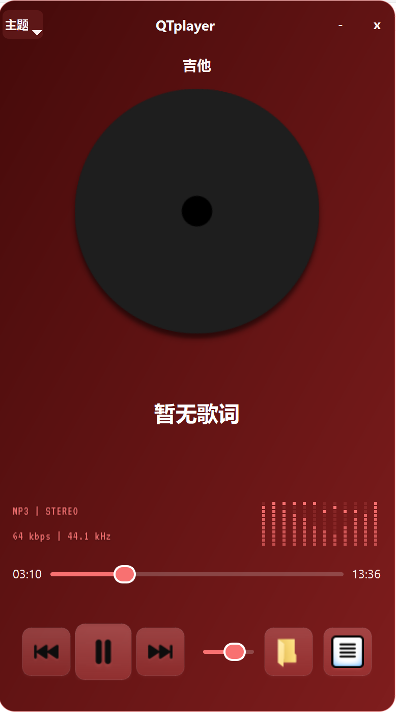

# 飞羽播放器

一个基于 PyQt6 的现代化音乐播放器，包含主题系统、歌词显示、点阵频谱等自定义控件，适合用于学习、演示与二次开发。有Windows,Linux,Mac版本

   

## ✨ 功能特性          

- 🎵 **多格式支持** - 支持 MP3、M4A、WAV、FLAC 等常见音频格式
- 🎨 **11种精美主题** - 自适应、深海、黑曜、翡翠、赛博、侘寂、暗金、幽灵、波尔多、极光、宇宙
- 🎭 **自适应主题** - 根据专辑封面自动提取主色调，动态调整界面配色
- 💿 **黑胶唱片动画** - 播放时唱片旋转，暂停时停止，带来沉浸式体验
- 📜 **歌词显示** - 支持 .lrc 文件和内嵌歌词，平滑滚动效果
- 📊 **点阵频谱** - 模拟 VFD 显示效果，播放时动态跳动
- 📋 **播放列表管理** - 添加、删除、排序歌曲，自动保存播放状态
- 💾 **状态记忆** - 自动保存播放进度、音量、主题等设置

## 📦 依赖

- Python 3.10+
- PyQt6 >= 6.4.0
- mutagen >= 1.47.0

## 🚀 安装与运行

### 1. 克隆仓库

```bash
git clone https://github.com/Somethingtoshare/QTplay.git
cd QTPlayer
```

### 2. 安装依赖

```bash
pip install -r requirements.txt
```

### 3. 运行程序

```bash
python mainrefector.py
```
## 项目结构（简略）

```
QTPlayer/
├── app_controller.py
├── app_state.py
├── component_lyrics_parser.py
├── component_metadata.py
├── component_theme_manager.py
├── component_widgets.py
├── mainrefector.py        # 当前项目的主入口（请根据需要调整）
├── playlist_manager.py
├── playlist_state.json
├── playlist.m3u
├── requirements.txt
├── README.md
├── theme.json
├── ui_helpers.py
├── utils.py
└── Assets/                # 主题、字体、资源等
```
├── playlist_manager.py
├── playlist_state.json
├── playlist.m3u
├── requirements.txt
├── README.md
├── theme.json
├── ui_helpers.py
├── utils.py
└── Assets/                # 主题、字体、资源等
=======
QT-Player/
├── main.py              # 主程序
├── requirements.txt     # 依赖列表
├── README.md            # 说明文档
├── 捕获.PNG             # 截图
└── Assets/
    └── VT323-Regular.ttf       # 点阵字体

>>>>>>> 7b4d6632182b19770885600e5d58b336fbd5f7ca
```

## 开发与调试

- 代码基于 PyQt6，推荐使用支持编辑 Qt UI 的 IDE（如 VS Code + Python 扩展）。
- 修改后可直接运行 `mainrefector.py` 进行调试。

## 未来计划

- 添加均衡器功能
- 在线歌词自动搜索
- 迷你/托盘模式
- 媒体按键与全局热键支持

## 作者

项目维护者：6666

## 许可证

本项目供学习与交流使用，未指定商业授权。若用于其它用途请联系作者获取许可。
